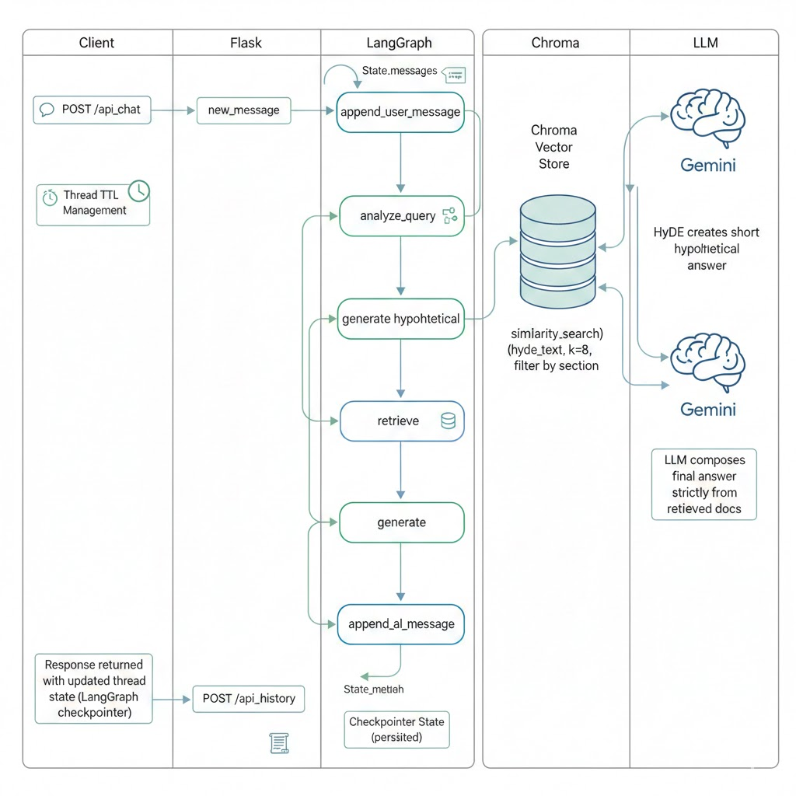
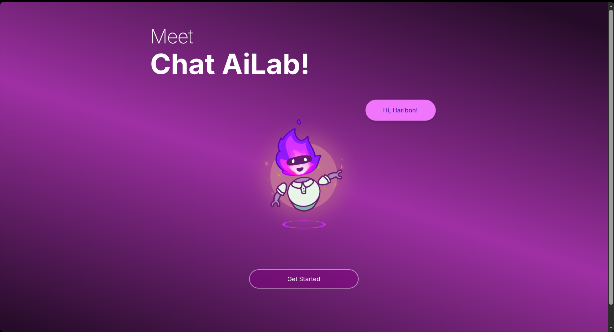
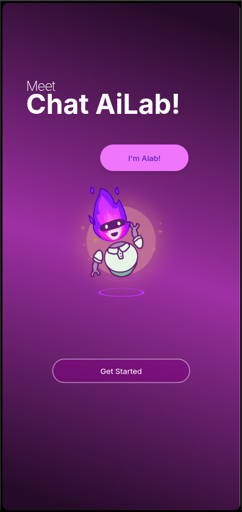
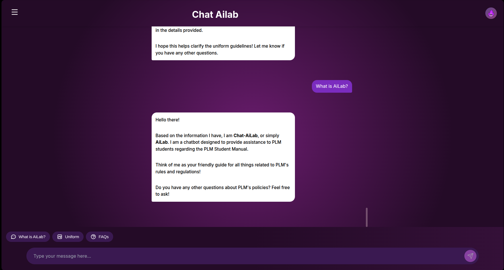
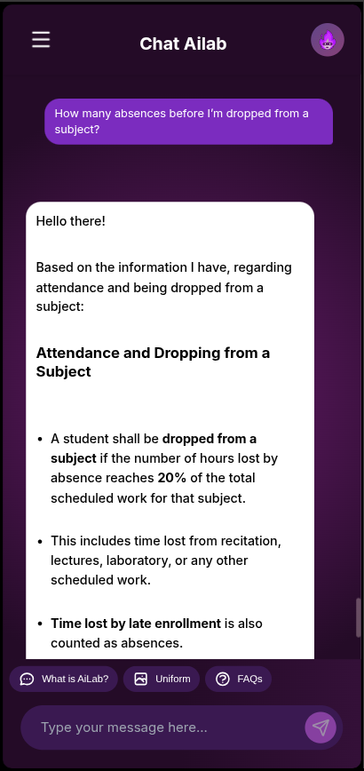

# PLM Assistant

A campus assistant chatbot powered by RAG using the PLM Student Manual as its knowledge base, with an interactive campus map and directions.

- Frontend: React
- Backend: Flask + LangGraph
- Vector Store: Chroma DB
- Models: Google Gemini for chat and embeddings

## RAG Diagram Representation:

<p align="center">
  
</p>

## Demo Screenshot





## Project Structure
- Backend: [backend/app.py](backend/app.py), [backend/rag_service.py](backend/rag_service.py), admin tools in [backend/admin](backend/admin)
- Frontend: [frontend/src](frontend/src), built assets in [frontend/build](frontend/build)
- Assets: [assets/images](assets/images)

## Backend Setup

### 1) Create a virtual environment
- Linux:
```sh
cd backend
python3 -m venv .venv
source .venv/bin/activate
```

- Windows (PowerShell):
```powershell
cd backend
python -m venv .venv
.\.venv\Scripts\activate
```

### 2) Install dependencies

```sh
pip install -r backend/requirements.txt
```


### 3) Environment variables
Create `backend/.env`:
```txt
LANGSMITH_TRACING=...       # optional
LANGSMITH_API_KEY=...       # optional
GOOGLE_API_KEY=...          # required
```

### 4) Build the vector store (Chroma)
- Bash
```sh
python3 backend/admin/rag_indexing.py
```

- Shell or Command Prompt:
```powershell
python backend/admin/rag_indexing.py
```

Paths are robust via:
- [`backend/admin/rag_indexing.py`](backend/admin/rag_indexing.py) uses:
  - BASE_DIR = folder of the script
  - DATA_DIR = admin/data
  - PERSIST_DIR = admin/data/chroma_plm_db

## Running

### Production-like (Linux only)
```sh
cd backend
gunicorn app:app
```

### Development (backend)
```sh
cd backend
flask --app app run
# or hot reload
flask --app app run --debug
```

### Development (frontend)
```sh
cd frontend
npm install
npm start
```

Frontend proxies API to backend via [`frontend/package.json`](frontend/package.json) "proxy": http://localhost:5000

## API Endpoints
- POST /api/chat
  - Body: `{ "message": "text", "thread_id": "<optional>" }`
  - Returns: `{ "response": "model reply", "thread_id": "uuid" }`
  - Implemented in [`backend/app.py`](backend/app.py), calls [`rag_service.run_state_graph`](backend/rag_service.py)

- POST /api/history
  - Body: `{ "thread_id": "uuid" }`
  - Returns conversation history from LangGraph checkpointer

## RAG Pipeline Overview
Defined in [`backend/rag_service.py`](backend/rag_service.py):
- [`append_user_message`](backend/rag_service.py)
- [`analyze_query`](backend/rag_service.py)
- [`generate_hypothetical`](backend/rag_service.py)
- [`retrieve`](backend/rag_service.py)
- [`generate`](backend/rag_service.py)
- [`append_ai_message`](backend/rag_service.py)

Vector store:
- Chroma initialized at startup in [`backend/rag_service.py`](backend/rag_service.py) with `persist_directory="./admin/data/chroma_plm_db"`

## Frontend Notes
- Chat UI: [`frontend/src/components/ChatInterface/Chat.js`](frontend/src/components/ChatInterface/Chat.js)
- Markdown rendering: ReactMarkdown + remarkGFM
- For compact spacing, see CSS in [`frontend/src/components/ChatInterface/Chat.css`](frontend/src/components/ChatInterface/Chat.css) and component overrides in Chat.js.

## License
This project is licensed under the MIT License. See [LICENSE](LICENSE) for details.
